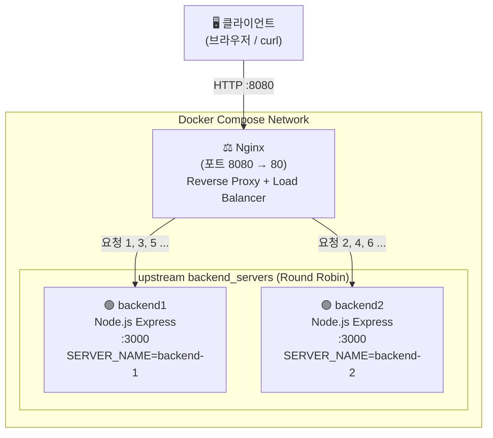

# Nginx Reverse Proxy + Load Balancing 실습

> 『요즘 개발자를 위한 시스템 설계 수업』 4장 — DNS, 로드밸런서, 게이트웨이 학습 내용을 코드로 실습합니다.

---

## 실습 목적

시스템 설계 이론에서 다룬 로드밸런서의 동작 방식을 직접 구성해본다.

- Nginx가 **Reverse Proxy** 역할을 수행하는 구조 이해
- **Round Robin** 방식으로 두 개의 백엔드 서버에 요청을 분산하는 과정 확인
- Docker Compose로 멀티 서버 환경을 로컬에서 재현

---

## 아키텍처 구조



---

## 실행 방법

```bash
# 1. 이미지 빌드 및 컨테이너 실행
docker compose up --build

# 2. 백그라운드 실행
docker compose up --build -d

# 3. 종료
docker compose down
```

---

## 테스트 방법

### 브라우저
http://localhost:8080 접속 후 새로고침을 반복하면 응답이 번갈아 바뀐다.

### curl 반복 호출
```bash
for i in {1..6}; do curl -s http://localhost:8080; echo; done
```

**예상 출력**
```json
{"server":"backend-1","message":"Hello from backend-1"}
{"server":"backend-2","message":"Hello from backend-2"}
{"server":"backend-1","message":"Hello from backend-1"}
{"server":"backend-2","message":"Hello from backend-2"}
{"server":"backend-1","message":"Hello from backend-1"}
{"server":"backend-2","message":"Hello from backend-2"}
```

### 실제 테스트 결과

```bash
$ curl -s http://localhost:8080
{"server":"backend-2","message":"Hello from backend-2"}

$ curl -s http://localhost:8080
{"server":"backend-1","message":"Hello from backend-1"}
```

Round Robin 방식으로 backend-1과 backend-2가 번갈아 응답하는 것을 확인했다.

---

## Nginx 설정 설명

### upstream — 백엔드 서버 그룹 정의

```nginx
upstream backend_servers {
    server backend1:3000;
    server backend2:3000;
}
```

- `upstream` 블록으로 여러 백엔드 서버를 하나의 그룹으로 묶는다
- 기본 분산 방식은 **Round Robin** — 요청이 들어올 때마다 순서대로 서버를 선택한다
- Docker Compose 네트워크에서 서비스명(backend1, backend2)이 호스트명으로 동작한다

### proxy_pass — 요청 전달

```nginx
location / {
    proxy_pass http://backend_servers;
}
```

- 클라이언트 요청을 upstream 그룹으로 전달한다
- Nginx가 어느 서버로 보낼지 결정하고, 클라이언트는 내부 구조를 알 필요가 없다

---

## 이번 실습에서 배운 점

**1. 로드밸런서는 단순 분산이 아니다**
클라이언트와 백엔드 사이에서 요청을 중계하고, 내부 서버 구조를 외부에 숨기는 역할을 한다.

**2. upstream 블록이 핵심이다**
서버 목록을 한 곳에서 관리하기 때문에 서버를 추가하거나 제거할 때 클라이언트 코드를 바꿀 필요가 없다.

**3. Docker Compose의 서비스명이 DNS 역할을 한다**
실제 운영 환경의 DNS와 같은 방식으로, 서비스명을 통해 컨테이너 간 통신이 이루어진다.

---

## 다음 개선 아이디어

**Health Check 추가**
```nginx
upstream backend_servers {
    server backend1:3000;
    server backend2:3000;
    # Nginx Plus 또는 OpenResty에서 active health check 지원
}
```
서버가 다운됐을 때 자동으로 제외하는 구조로 개선할 수 있다.

**least_conn 방식 적용**
```nginx
upstream backend_servers {
    least_conn;
    server backend1:3000;
    server backend2:3000;
}
```
현재 연결 수가 가장 적은 서버로 요청을 보내는 방식 — 처리 시간이 다른 서버 간 부하를 더 균등하게 나눈다.

**API Gateway와의 비교**
- Nginx: 인프라 레벨의 트래픽 분산, 설정 기반
- API Gateway(AWS API Gateway, Kong 등): 인증/인가, 요청 변환, 속도 제한 등 비즈니스 로직 포함
- 실제 운영에서는 Nginx(로드밸런서) + API Gateway를 계층으로 함께 사용하는 경우가 많다
